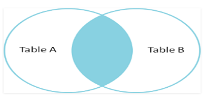
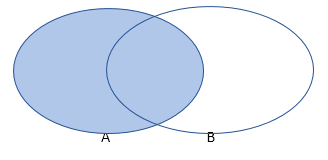
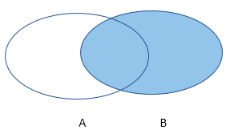
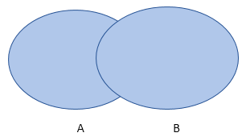

# Lesson: Introduction To Advanced SQL Queries

## Objective:

- To understand how to use table joins in a query.
- To understand how to use sub-query's.
- To understand how to create views.
- To understand hwo to use the UNION clause.
- To understand query alias's.
- To understand how and when to create indexes.

## Pre-requisites:

- Basic understanding of SQL query's
- Basic understanding of relational database table management.
- Access to the MySQL database container and a connected client.

## Outline:

#### Functions

MySQL functions are pre-defined commands that perform specific operations on data in a MySQL database. These functions
are designed to simplify the process of manipulating data and performing calculations, comparisons, and transformations
on data stored in a MySQL database.

MySQL functions are divided into several categories, including string functions, date and time functions, mathematical
functions, aggregate functions, and control flow functions. Each category of functions is designed to perform specific
tasks, such as converting data types, manipulating strings, and performing calculations.

- `String functions` are used to manipulate text data, and they can be used to concatenate, trim, and search for
  specific
  characters or strings within a text. Date and time functions, on the other hand, are used to manipulate and perform
  calculations on date and time values stored in a MySQL database.

* `Mathematical functions` are used to perform calculations on numeric data, such as finding the absolute value,
  calculating
  logarithms, and rounding numbers. Aggregate functions are used to perform calculations on groups of data, such as
  finding the sum, average, or maximum value of a set of values.

- `Control flow functions` are used to perform conditional operations, such as IF statements and case statements, which
  allow for the execution of different commands based on specific conditions.

Function provide a powerful toolset for manipulating and processing data stored in a MySQL database, making it easier to
perform complex calculations, comparisons, and transformations on large datasets. In this course we will only cover a
small subset of the available functions. To discover what else is available, you should refer to the documentation.

###### Refer to ```functions.demo.sql``` for demonstration examples

###### Refer to ```functions.practice.sql``` for the practice project

###### Refer to ```functions.key.sql``` for a solved practice project example

#### Table Joins

Joins plays an essential role in joining two tables together based on one or more common values shared by two tables.
Used to combine data from two or more tables into a single result set based on a common column or columns between them.
Joining tables is essential when working with relational databases as it allows for more complex queries and the ability
to retrieve data from multiple tables simultaneously.

There are different types of table joins such as `INNER JOIN`, `LEFT JOIN`, `RIGHT JOIN`, and `FULL OUTER JOIN`, and the
choice of join type depends on the specific requirements of the query.

- `INNER JOIN`
  
  Returns only the rows where there is a match in both tables

- `LEFT JOIN`
  
  Returns all the rows from the left table and the matching rows from the right table

- `RIGHT JOIN`
  
  Returns all the rows from the right table and the matching rows from the left table

- `FULL OUTER JOIN`
  
  Returns all the rows from both tables, with null values in the columns where there is no match.

The syntax for writing a join statement involves specifying the tables to be joined and the columns to be selected, and
the join condition that defines how the tables are related.

There are a few more join types in MySQL but we will not be covering them at this time.

- `CROSS JOIN`
  https://www.w3schools.com/mysql/mysql_join_cross.asp
- `SELF JOIN`
  https://www.w3schools.com/mysql/mysql_join_self.asp

###### Refer to ```table-join.demo.sql``` for demonstration examples

###### Refer to ```table-join.practice.sql``` for the practice project

###### Refer to ```table-join.key.sql``` for a solved practice project example

### Conclusion